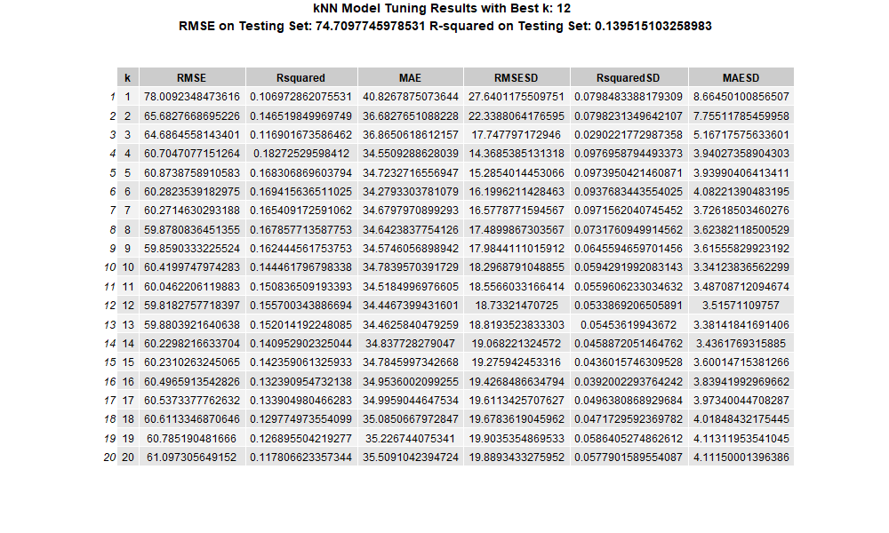

# Summary

Here, we attempt to build a regression model using the k-nearest
neighbors (kNN) algorithm to predict the number of weeks an album spends
on the Billboard chart `weeks_on_billboard` based on characteristics
such as `release_year`, `peak_billboard_position`, and
`spotify_popularity`. This model could help music industry analysts,
artists, and record labels understand the factors that contribute to an
album’s longevity on the chart and make informed decisions about
marketing and production strategies.

```{r getlines}
lines <- readLines("output.txt")
hcor <- round(as.numeric(substr(lines[1], 6, nchar(lines[1]))),2)
lcor <- round(as.numeric(substr(lines[2], 6, nchar(lines[2]))),2)
tiqr <- round(as.numeric(substr(lines[3], 6, nchar(lines[3]))),2)
rmse <- round(as.numeric(substr(lines[4], 6, nchar(lines[4]))),2)
perr <- round(as.numeric(substr(lines[5], 6, nchar(lines[5])))*100,2)
```

Our current model has a prediction error, as measured by the Root Mean
Squared Error (RMSE), of approximately `{r} rmse` weeks. This model has room
for improvement, given that the weeks_on_billboard values has an
Interquartile range of about `{r} tiqr` weeks.

# Introduction

The data used to build this model comes from Rolling Stone's rankings
dataset, which includes information about album releases, chart
performance, and artist details. The dataset was sourced from
TidyTuesday, compiles information from Rolling Stone magazine’s renowned
"The 500 Greatest Songs of All Time" lists. These lists were published
in 2003, 2012, and 2020, each representing a snapshot of the most
influential and celebrated songs according to music critics, artists,
and industry experts at the time.

| Variable | Class | Description |
|:------------------|:------------------|:---------------------------------|
| sort_name | character | Name used for sorting |
| clean_name | character | Clean name |
| album | character | Album name |
| rank_2003 | double | Rank in 2003. NA if album not released yet or not in top 500 |
| rank_2012 | double | Rank in 2012. NA if album not released yet or not in top 500 |
| rank_2020 | double | Rank in 2020. NA if not in top 500 |
| differential | double | 2020-2003 Differential. Negative value if it went down in the chart. Positive value if it went up. |
| release_year | double | Release Year |
| genre | character | Album Genre |
| type | character | Album Type |
| weeks_on_billboard | double | Weeks on Billboard |
| peak_billboard_position | double | Peak Billboard Position |
| spotify_popularity | double | Spotify Popularity. NA if not on Spotify |
| spotify_url | character | Spotify URL. NA if not on Spotify |
| artist_member_count | double | Number of artists in the group |
| artist_gender | character | Gender of the artist(s). Male/Female if it's a mixed-gender group |
| artist_birth_year_sum | double | Sum of the artists' birth years |
| debut_album_release_year | double | Debut Album Release Year |
| ave_age_at_top_500 | double | Average age at top 500 Album |
| years_between | double | Years Between Debut and Top 500 Album |
| album_id | character | Album ID. NOS at the beginning of the ID if not on Spotify |

Part of the dataset shows the album rankings on the Billboard 200 Chart.
The latter is a widely recognized measure of an album’s commercial
success. Understanding the factors that contribute to an album’s
longevity on the chart can provide valuable insights for artists, record
labels, and music industry analysts. For example:

Artists: Can use this information to plan album releases and marketing
strategies.

Record Labels: Can identify trends and allocate resources effectively.

Analysts: Can predict the potential success of new albums based on
historical data.

In this project, we aim to answer the following question: Can we use
characteristics of an album (e.g., release year, peak chart position,
Spotify popularity) to predict how long it will stay on the Billboard
chart?

To answer this question, we used a k-nearest neighbors (kNN) regression
model and data from Rolling Stone's rankings. We found that our model
has a prediction error of approximately `{r} rmse` weeks, which is reasonable
given the variability in the data. However, there is room for
improvement, as the model explains `{r} perr`% of the variability in
weeks_on_billboard.

# Methodolgy

## Importing the data

We imported the data set from TidyTuesday's Github into the data
directory. Using domain expertise and exploartory analysis, we chose to
focus on the following predictor variables:

Table 1. Predictor variables used for analysis, chosen for their utility
by domain expertise.

| Predictor | Description |
|--------------------------|----------------------------------------------|
| release_year | The year the album was released. |
| peak_billboard_position | The highest position the album reached on the Billboard chart. |
| spotify_popularity | A measure of the album’s popularity on Spotify (0–100 scale). |
| artist_gender | The artist's gender. |

## Preliminary Analysis

### Loading The Necessary Libraries

The necessary packages and libraries from the R programming language
used in this analysis include `tidyr`, `dplyr`, `readr`, `ggplot2`,
`ggpubr` and `caret`.

### Wrangling

The data set used in this project was cleaned and prepared for analysis
through several steps. First, numerical columns which had a large number
of missing values(25% of total) and were poorly correlated as found in
the EDA later were removed. Categorical variables like sort_name,
clean_name, album(name), spotify_url, etc. were removed, as they were
not relevant to the analysis, and it would be difficult to use these
variables as they are close to unique identifiers. Next, missing values
were handled: the genre and type columns were imputed using the most
frequent strategy, and the weeks_on_billboard column was imputed using
the mean strategy, as removing these would have significantly skewed the
analysis. Rows with missing values in other columns were dropped to
ensure a complete dataset. Finally, all numeric predictors were scaled
to ensure equal weighting in the kNN algorithm. These steps resulted in
a clean, analysis-ready dataset.

### Data Splitting

The data was partitioned into training (80%) and testing (20%) sets. The
relationship between weeks_on_billboard and the predictor variables was
visualized using scatter plots and boxplots to assess their utility for
predictive modeling. Correlation was also used to assess the
relationship betweent the response and the predictors.

## Exploratory Analysis

In the exploratory data analysis (EDA), we first examined relationships
between numeric variables and weeks_on_billboard using scatter plots
with linear trendlines. This helped us visualize potential linear
associations and identify predictors that might be strongly related to
the target variable. Correlation values were also computed to quantify
the strength of these relationships, highlighting which variables have
positive or negative impacts on Billboard longevity.

Furthermore, we explored categorical variables — genre, artist_gender,
and type — through boxplots to assess how weeks_on_billboard varies
across different categories. These visualizations provided insights into
how factors like album type and artist gender may influence chart
success, and revealed potential group-level differences that could be
important for modeling. Overall, the EDA gave a clearer picture of key
patterns and relationships in the data.

::: {#fig-viz}

{#fig-viz}

Scatterplots and boxplots for EDA
:::
## Predictor Selection and Model Execution

For predictor selection, we focused on identifying variables that had
meaningful relationships with weeks_on_billboard and were relevant to
understanding album success. Variables with an absolute correlation
greater than 0.2 were prioritized, as these are more likely to
contribute valuable information to the model. Based on this criterion,
we selected release_year, peak_billboard_position, spotify_popularity,
and debut_album_release_year as predictors. Variables with weak
correlations, such as differential, artist_member_count, and
artist_birth_year_sum, were excluded to prevent unnecessary complexity
and reduce the risk of overfitting.

After selecting predictors, we cleaned and scaled the datasets using
min-max normalization to ensure all numeric variables were on a
comparable scale. We also handled mismatches in categorical levels
between training and testing datasets by filtering out unseen categories
from the test set. A k-Nearest Neighbors (kNN) model was then trained
using 5-fold cross-validation to tune the optimal value of k, evaluating
performance with RMSE. The final model was assessed on the test set,
where both RMSE and R-squared were calculated to measure prediction
accuracy and explained variance. This process ensured a robust approach
to selecting meaningful predictors and building a well-tuned predictive
model.

::: {#fig-results}

{#fig-results}

knn-tuning results
:::

# Discussion

Our interpretation of the data: The correlations between the predictors
and the weeks on the billboard were generally weak. The variable that
correlated with the weeks on the billboard most was the spotify
popularity, which is expected since both are direct measurements of the
popularity of the album. The correlation was `{r} hcor`. The variable
that correlated with the weeks on the billboard the least was the years
between the release date of the album and the first album the artist
released. This was a bit surprising since people might expect more
experienced artists to make more popular works. The correlaton was
`{r} lcor`.

Implications of the data: The data could be used to predict the peak
productivity of artists and determine which artists show the most
promise in regard to their future career opportunities. Our data seems
to imply that artists peak early in their careers. This may imply that
the conditions required to produce popular music are mainly
circumstantial and are difficult to recreate. This may raise future
questions such as whether hiring based on experience is a good practice
in some industries. 

# References

@GlobalNews 
@Morris
@Bove
@Richter

